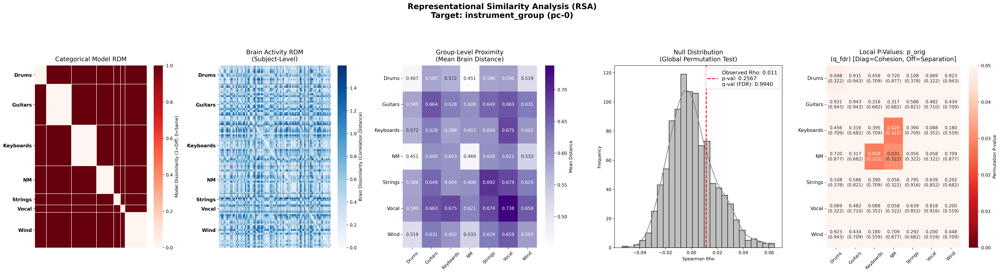
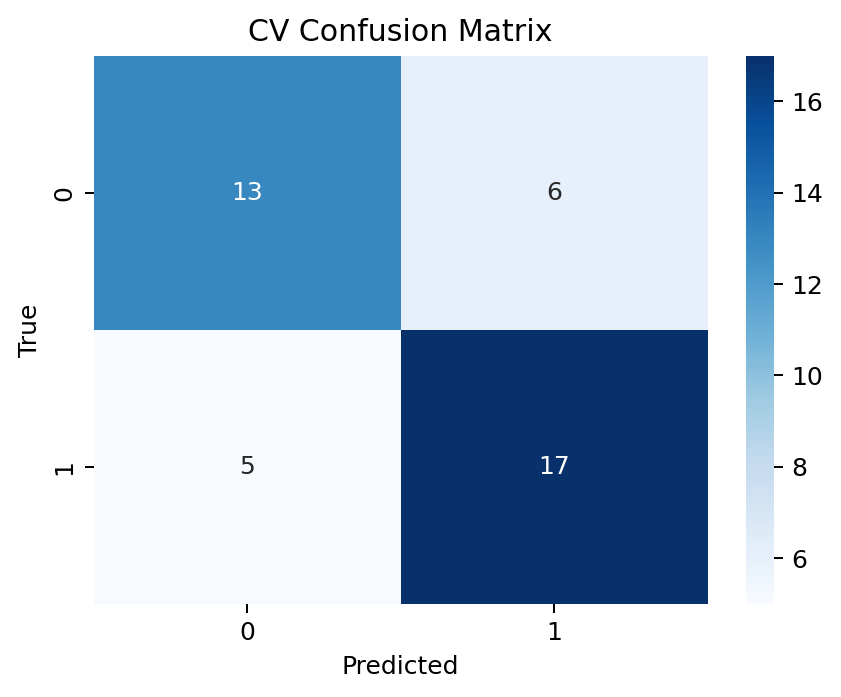
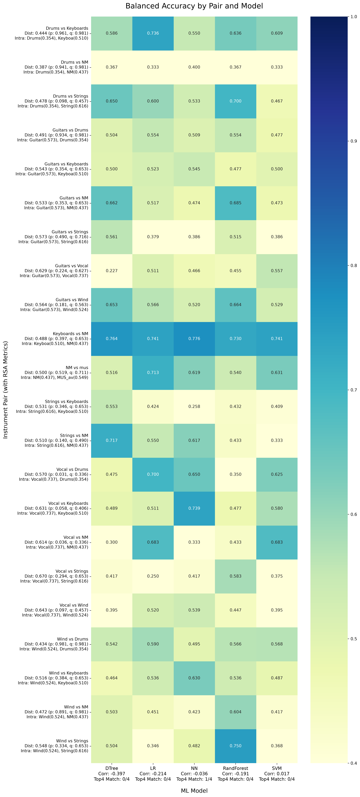

Group fPCA Pipeline
===================

This page documents the end-to-end workflow for group-level functional PCA and downstream group-discrimination analysis.

The workflow has two main stages:

1. **``fpca-main``** — extract per-subject B-spline coefficients, build a shared group PCA space on the training set, and project held-out test subjects into that space.
2. **``fmri-fpca-pipeline``** — reconstruct spatiotemporal signals from the group PCA outputs, run alignment / RSA analysis, train ML classifiers, and evaluate generalization on a test set.

.. contents:: Table of Contents
   :depth: 3

Overview
--------

Recommended execution order:

.. code-block:: text

   Training/Test subjects (same output folder)
   └── fpca-main  --mode pca-singles        (per-subject analysis train and test sets together)

   Training subjects only
   └── fpca-main  --mode train-pca-group  (shared group PCA train set only)

   Test subjects only
   └── fpca-main  --mode test-pca-project   (project test set onto training PCA space)

   Downstream analysis (per PC, per movement)
   ├── fmri-fpca-pipeline  --mode align-signals
   ├── fmri-fpca-pipeline  --mode ml
   ├── fmri-fpca-pipeline  --mode stat
   └── fmri-fpca-pipeline  --mode ml-test   (selected pairs only)

.. note::

   ``pca-singles`` and ``train-pca-group`` / ``test-pca-project`` must be run as **separate invocations**.
   When a group mode is present, ``fpca-main`` collects existing per-subject outputs instead of re-running single-subject analysis.

Entry Point:
------------

Input file naming
~~~~~~~~~~~~~~~~~

The pipeline expects preprocessed BOLD files and matching masks. For training and test sets,
the BOLD files and masks should be organized as follows:

.. code-block:: text

   input_dir_train/
   ├── sub-<sample-1>_ses-[A-Za-z0-9]+.*-movement1_.*-preproc_bold.nii.gz
   ├── sub-<sample-1>_ses-[A-Za-z0-9]+.*-movement2_.*-brain_mask.nii.gz
   ├── sub-<sample-1>_ses-[A-Za-z0-9]+.*-movement1_.*-preproc_bold.nii.gz
   ├── sub-<sample-1>_ses-[A-Za-z0-9]+.*-movement2_.*-brain_mask.nii.gz
   ├── ...
   ├── sub-<sample-N>_ses-[A-Za-z0-9]+.*-movement1_.*-preproc_bold.nii.gz
   ├── sub-<sample-N>_ses-[A-Za-z0-9]+.*-movement2_.*-brain_mask.nii.gz
   ├── sub-<sample-N>_ses-[A-Za-z0-9]+.*-movement1_.*-preproc_bold.nii.gz
   └── sub-<sample-N>_ses-[A-Za-z0-9]+.*-movement2_.*-brain_mask.nii.gz

   input_dir_test/
   ├── sub-<sample-1>_ses-[A-Za-z0-9]+.*-movement1_.*-preproc_bold.nii.gz
   ├── sub-<sample-1>_ses-[A-Za-z0-9]+.*-movement2_.*-brain_mask.nii.gz
   ├── sub-<sample-1>_ses-[A-Za-z0-9]+.*-movement1_.*-preproc_bold.nii.gz
   ├── sub-<sample-1>_ses-[A-Za-z0-9]+.*-movement2_.*-brain_mask.nii.gz
   ├── ...
   ├── sub-<sample-M>_ses-[A-Za-z0-9]+.*-movement1_.*-preproc_bold.nii.gz
   ├── sub-<sample-M>_ses-[A-Za-z0-9]+.*-movement2_.*-brain_mask.nii.gz
   ├── sub-<sample-M>_ses-[A-Za-z0-9]+.*-movement1_.*-preproc_bold.nii.gz
   └── sub-<sample-M>_ses-[A-Za-z0-9]+.*-movement2_.*-brain_mask.nii.gz

Part 1 — ``fpca-main`` script
-----------------------------

A. Mode: ``pca-singles``
~~~~~~~~~~~~~~~~~~~~~~~~

Runs independent functional PCA on each subject. For every subject this mode:

1. Applies preprocessing (filtering, smoothing) unless ``--processed`` is set.
2. Fits B-spline basis functions and extracts voxel-wise **coefficient matrices**.
3. Performs subject-level PCA and saves all results under that subject's output folder.

The key artifact for later group analysis is ``eigvecs_eigval_F.npz``, which stores the per-voxel B-spline **coefficient matrix** (``C``), along with the subject-specific eigenvectors, eigenvalues, basis matrix ``F``, and time vector.

When ``--low-mem`` is set, only NPZ/TXT/NIfTI files are written (no PNG plots).

The full description of the other parameters can be found in :doc:`running`.

Example --- automatically collect files using Bash and run fpca-main on each one with the default parameters:
^^^^^^^^^^^^^^^^^^^^^^^^^^^^^^^^^^^^^^^^^^^^^^^^^^^^^^^^^^^^^^^^^^^^^^^^^^^^^^^^^^^^^^^^^^^^^^^^^^^^^^^^^^^^^

- Run the following script twice with the same output directory, once for the training set and once for the test set:

.. code-block:: bash

    chmod +x run_fpca.sh
    ./run_fpca.sh /path/to/fpca-env pca-singles /path/to/preprocessed/input_dir_train /path/to/output
    ./run_fpca.sh /path/to/fpca-env pca-singles /path/to/preprocessed/input_dir_test /path/to/output

For example, if your virtual environment is located at ``/home/user/fpca-env``, your preprocessed input directories are ``/home/user/preprocessed/input_dir_train``/``/home/user/preprocessed/input_dir_test``, and you want the output to go to ``/home/user/output_pca``, you would run:

.. code-block:: bash

    chmod +x run_fpca.sh
    ./run_fpca.sh /home/user/fpca-env pca-singles /home/user/preprocessed/input_dir_train /home/user/output_pca
    ./run_fpca.sh /home/user/fpca-env pca-singles /home/user/preprocessed/input_dir_test /home/user/output_pca

run_fpca.sh file content:

.. code-block:: bash

    #!/usr/bin/env bash

    # Activate the virtual environment from the first argument
    source "$1/bin/activate"

    # Assign the remaining arguments to variables
    MODE="$2"
    INPUT_DIR="$3"
    PROJECT_OUTPUT_DIR="$4"
    #########################################################################################

    mkdir -p "$PROJECT_OUTPUT_DIR"

    # Force mathematical libraries to use exactly one thread per process
    # This is crucial to prevent CPU thrashing when running parallel jobs
    export OMP_NUM_THREADS=1
    export OPENBLAS_NUM_THREADS=1
    export MKL_NUM_THREADS=1
    export VECLIB_MAXIMUM_THREADS=1
    export NUMEXPR_NUM_THREADS=1

    # Initialize separate arrays for movement 1 and movement 2
    NII_FILES_MOV1=()
    MASK_FILES_MOV1=()

    NII_FILES_MOV2=()
    MASK_FILES_MOV2=()

    # Loop through all files and categorize them based on the task string
    for bold_file in "$INPUT_DIR"/*.nii.gz; do
        if [ -f "$bold_file" ]; then
            filename=$(basename "$bold_file")
            base=${filename%%-preproc_bold*}
            mask_file="$INPUT_DIR/${base}-brain_mask.nii.gz"

            if [ -f "$mask_file" ]; then
                # Route to mov1 arrays if the filename contains '-movement1'
                if [[ "$filename" == *"-movement1"* ]]; then
                    NII_FILES_MOV1+=("$bold_file")
                    MASK_FILES_MOV1+=("$mask_file")
                # Route to mov2 arrays if the filename contains '-movement2'
                elif [[ "$filename" == *"-movement2"* ]]; then
                    NII_FILES_MOV2+=("$bold_file")
                    MASK_FILES_MOV2+=("$mask_file")
                fi
            fi
        fi
    done

    # ==========================================
    # Execute Group fPCA for Movement 1
    # ==========================================
    echo "Found ${#NII_FILES_MOV1[@]} subjects for Movement 1. Starting Group fPCA pipeline..."

    OUTPUT_DIR_MOV1="$PROJECT_OUTPUT_DIR"/outputs_mov1
    if [ ${#NII_FILES_MOV1[@]} -gt 0 ]; then
        fpca-main \
            --mode "$MODE" \
            --nii-files "${NII_FILES_MOV1[@]}" \
            --mask-files "${MASK_FILES_MOV1[@]}" \
            --output-folder "$OUTPUT_DIR_MOV1" \
            --calc-penalty-skfda \
            --n-jobs 5 \
            --low-mem
    else
        echo "Warning: No files found for Movement 1. Skipping..."
    fi

    echo "--------------------------------------------------"

    # ==========================================
    # Execute Group fPCA for Movement 2
    # ==========================================
    echo "Found ${#NII_FILES_MOV2[@]} subjects for Movement 2. Starting Group fPCA pipeline..."

    OUTPUT_DIR_MOV2="$PROJECT_OUTPUT_DIR"/outputs_mov2
    if [ ${#NII_FILES_MOV2[@]} -gt 0 ]; then
        fpca-main \
            --mode "$MODE" \
            --nii-files "${NII_FILES_MOV2[@]}" \
            --mask-files "${MASK_FILES_MOV2[@]}" \
            --output-folder "$OUTPUT_DIR_MOV2" \
            --n-jobs 5 \
            --calc-penalty-skfda \
            --low-mem
    else
        echo "Warning: No files found for Movement 2. Skipping..."
    fi

    echo "All tasks completed successfully!"

Output directory layout
^^^^^^^^^^^^^^^^^^^^^^^

After a full training run, each subject's outputs in each movement are written to a sub-folder named after ``<base>`` (the part before ``-preproc_bold``).

The output folder typically looks like:

.. code-block:: text

   proj_output/
   ├── outputs_mov1/
   │   ├── global_F_U_matrices.npz
   │   ├── sample-1/
   │   │   ├── eigvecs_eigval_F.npz
   │   │   ├── original_averaged_signal_intensity.png
   │   │   ├── eigenfunction_0_importance_map.nii.gz
   │   │   ├── eigenfunction_1_importance_map.nii.gz
   │   │   ├── ...
   │   │   ├── eigenfunction_0_best_voxel.txt
   │   │   ├── eigenfunction_1_best_voxel.txt
   │   │   ├── ...
   │   │   ├── temporal_profile_pc_0.txt
   │   │   ├── temporal_profile_pc_1.txt
   │   │   └── ...
   │   ├──...
   │   ├──...
   │   ├── sample-N/
   │   │   └── ...
   ├── outputs_mov2/
   │   ├── global_F_U_matrices.npz
   │   ├── sample-1/
   │   │   └── ...
   │   ├──...
   │   ├── sample-N/
   │   │   └── ...

B. Mode: ``train-pca-group``
~~~~~~~~~~~~~~~~~~~~~~~~~~~~

Builds a **shared group PCA space** across all listed training subjects.

This mode reads the coefficient matrices saved by ``pca-singles`` (from ``eigvecs_eigval_F.npz``), computes a global mean and group covariance, and extracts group-level principal components. Each group PC index then represents the same functional pattern across subjects — a property **not** guaranteed when PCA is run independently per subject.

The mode also writes group-level temporal profiles and per-subject spatial scores/maps in the shared PC space.

**Prerequisites:** ``pca-singles`` must have been run on all training subjects into the same ``--output-folder``.

Example --- run fpca-main in mode ``train-pca-group`` on the training set:
^^^^^^^^^^^^^^^^^^^^^^^^^^^^^^^^^^^^^^^^^^^^^^^^^^^^^^^^^^^^^^^^^^^^^^^^^^

- Run the following script with the same output directory as in the first step.

.. code-block:: bash

    ./run_fpca.sh /path/to/fpca-env train-pca-group /path/to/preprocessed/input_dir_train /path/to/output

For example, if your virtual environment is located at ``/home/user/fpca-env``, your preprocessed input directory of the train set is ``/home/user/preprocessed/input_dir_train``, and you want the output to go to ``/home/user/output_pca``, you would run:

.. code-block:: bash

    ./run_fpca.sh /home/user/fpca-env train-pca-group /home/user/preprocessed/input_dir_train /home/user/output_pca

Group-level outputs (``train-pca-group``)
^^^^^^^^^^^^^^^^^^^^^^^^^^^^^^^^^^^^^^^^^^

This step add "group" files into the existing output folders.

The output folder typically looks like:

.. code-block:: text

   proj_output/
   ├── outputs_mov1/
   │   ├── global_mean.npy
   │   ├── global_eigvecs.npy
   │   ├── global_F_U_matrices.npz
   │   ├── sample-1/
   │   │   ├── eigvecs_eigval_F.npz
   │   │   ├── global_pca_scores.npy
   │   │   ├── original_averaged_signal_intensity.png
   │   │   ├── eigenfunction_0_importance_map.nii.gz
   │   │   ├── eigenfunction_1_importance_map.nii.gz
   │   │   ├── eigenfunction_0_importance_map_group.nii.gz
   │   │   ├── eigenfunction_1_importance_map_group.nii.gz
   │   │   ├── ...
   │   │   ├── eigenfunction_0_best_voxel.txt
   │   │   ├── eigenfunction_1_best_voxel.txt
   │   │   ├── ...
   │   │   ├── temporal_profile_pc_0.txt
   │   │   ├── temporal_profile_pc_1.txt
   │   │   ├── temporal_profile_pc_0_group.txt
   │   │   ├── temporal_profile_pc_1_group.txt
   │   │   └── ...
   │   ├──...
   │   ├──...
   │   ├── sample-N/
   │   │   └── ...
   ├── outputs_mov2/
   │   ├── global_mean.npy
   │   ├── global_eigvecs.npy
   │   ├── global_F_U_matrices.npz
   │   ├── sample-1/
   │   │   └── ...
   │   ├──...
   │   ├── sample-N/
   │   │   └── ...

Files at the **output-folder root**:

.. list-table::
   :header-rows: 1
   :widths: 35 65

   * - File
     - Description
   * - ``global_mean.npy``
     - Global mean of B-spline coefficients across all training voxels. Used to center test data during projection.
   * - ``global_eigvecs.npy``
     - Group eigenvectors. Defines the shared PC space.
   * - ``global_F_U_matrices.npz``
     - Basis matrix ``F`` and penalty matrix ``U`` (exported from the first processed subject).
   * - ``temporal_profile_pc_<k>_group.txt`` / ``.png``
     - Group-level temporal profile for PC ``k``.

Per-subject files (inside each subject folder):

.. list-table::
   :header-rows: 1
   :widths: 35 65

   * - File
     - Description
   * - ``global_pca_scores.npy``
     - Contains the combined spatial scores for all extracted Principal Components (PCs) per subject, serving as the primary feature matrix for the downstream Machine Learning pipeline.
   * - ``eigenfunction_<k>_importance_map_group.nii.gz``
     - 3D spatial importance map for PC ``k`` in the **group** space.
   * - ``eigenfunction_<k>_importance_map_group.png``
     - Middle-slice plot (skipped with ``--low-mem``).

C. Mode: ``test-pca-project``
~~~~~~~~~~~~~~~~~~~~~~~~~~~~~

Projects **test-set** subjects onto the PCA space learned during ``train-pca-group``.

For each test subject the pipeline:

1. Loads the subject's coefficient matrix from ``eigvecs_eigval_F.npz`` (produced by ``pca-singles`` on the test subject).
2. Centers the coefficients using the **training** ``global_mean.npy``.
3. Computes spatial scores using the **training** ``global_eigvecs.npy``.
4. Saves projected scores and 3D importance maps.

**Prerequisites:**

* ``train-pca-group`` completed on training subjects in the parent output folder.
* ``pca-singles`` completed on **every test subject** (into subject folders under the same output tree).
* ``global_mean.npy`` and ``global_eigvecs.npy`` must exist two levels above each test subject folder (i.e. at the movement output root).

Example --- run fpca-main in mode ``test-pca-project`` on the training set:
^^^^^^^^^^^^^^^^^^^^^^^^^^^^^^^^^^^^^^^^^^^^^^^^^^^^^^^^^^^^^^^^^^^^^^^^^^^

- Run the following script with the same output directory as in the first step.

.. code-block:: bash

    ./run_fpca.sh /path/to/fpca-env test-pca-project /path/to/preprocessed/input_dir_test /path/to/output

For example, if your virtual environment is located at ``/home/user/fpca-env``, your preprocessed input directory of the train set is ``/home/user/preprocessed/input_dir_test``, and you want the output to go to ``/home/user/output_pca``, you would run:

.. code-block:: bash

    chmod +x run_fpca.sh
    ./run_fpca.sh /home/user/fpca-env test-pca-project /home/user/preprocessed/input_dir_test /home/user/output_pca

Test-set outputs (``test-pca-project``)
^^^^^^^^^^^^^^^^^^^^^^^^^^^^^^^^^^^^^^^

.. list-table::
   :header-rows: 1
   :widths: 35 65

   * - File
     - Description
   * - ``global_pca_scores_proj.npy``
     - Projected spatial scores in the training group PC space.
   * - ``eigenfunction_<k>_importance_map_group_test_proj.nii.gz``
     - 3D importance map for PC ``k`` after projection onto the training space.

Part 2 — ``fmri-fpca-pipeline`` script
--------------------------------------

Workflow
~~~~~~~~

1. **``align-signals``** (run first) — computes RSA distances between instrument groups based on the **full recovered time series**, not isolated feature windows. Identifies which group pairs are most separated in signal space.
2. **``ml``** — trains classifiers on extracted features from the training set. Saves the best model per (model, hyperparameters) combination.
3. **``stat``** — merges ML balanced-accuracy scores with RSA metrics from step 1. Use this to identify pairs that are both ML-discriminable **and** consistent with whole-sequence alignment.
4. **``ml-test``** — apply saved models to held-out test subjects for pairs selected from step 3. Configure pairs in ``test_pairs.json`` (see below).

.. note::

   ML training uses windowed / event-driven **features** extracted from the signal, while ``align-signals`` operates on the **full sequence**. Reviewing ``stat`` output helps confirm that ML findings are consistent with whole-signal RSA separation.

Entry point for downstream group-discrimination analysis on the outputs of Part 1.

.. code-block:: bash

   fmri-fpca-pipeline \
       --mode <MODE> \
       --input-dir <DIR> \
       --output-dir <DIR> \
       --metadata-csv <CSV> \
       --ml-hyperparameters-file <JSON> \
       [options]

Parameters
~~~~~~~~~~

**Modes** (can be combined in one invocation, e.g. ``--mode align-signals ml``):

* ``align-signals`` — signal alignment and RSA analysis on the full recovered spatiotemporal sequence.
* ``ml`` — train ML classifiers on the training set (``is_train_set == 1``).
* ``stat`` — cross-reference ML results with RSA alignment metrics.
* ``ml-test`` — evaluate saved models on the test set for pairs listed in ``--test-pairs-file``.
* ``all`` — run all of the above in sequence.

**Key options**

* ``--target-pc-index <INT>`` — which PC to analyze (``0`` … ``n_pcs-1``). Run separately for each PC.
* ``--n-pcs`` — number of PCs available in the input (default: ``7``).
* ``--extra-features-set`` — feature extraction mode: ``0`` = flattened signal only; ``1`` = fixed 3-window split; ``2`` = event-driven music transitions (default: ``1``).
* ``--n-permutations`` — permutations for the ML significance test (default: ``200``).
* ``--test-pairs-file`` — JSON file listing class pairs to evaluate in ``ml-test`` mode.
* ``--ml-models`` — models to train (default: ``LR SVM NN DTree RandForest``).
* ``--groups`` — instrument groups for pairwise comparisons.
* ``--jobs`` — parallel workers for ML grid search (default: ``16``).

**files arguments**

* ``--input-dir`` — parent directory containing ``outputs_mov1/`` and ``outputs_mov2/`` from ``fpca-main``.
* ``--output-dir`` — directory for pipeline outputs (alignment, ML, statistics, test results).
* ``--metadata-csv`` — participant metadata (must include ``sub_id``, ``instrument_group``, ``is_train_set``, and genre columns).
* ``--ml-hyperparameters-file`` — JSON file with hyperparameter grids per model (see example bellow).
* ``--test-pairs-file`` — JSON file containing specific pairs to evaluate in test mode (see example bellow).
* ``--use-raw-data`` / ``--raw-data-path`` — optional alternative that uses raw BOLD time series instead of recovered PC signals.

Requied files
~~~~~~~~~~~~~

- Prepare a metadata CSV file with columns ``sub_id``, ``instrument_group``, ``is_train_set``, and any other grouping columns you want to analyze (e.g. ``group``, ``genre``). See an example in `status_fMRI_participants.csv <_static/status_fMRI_participants-example.csv>`_.
  Note that in last column, ``is_train_set``, a value of ``1`` indicates that the subject is part of the training set (all subjects in ``/home/user/preprocessed/input_dir_train``), while ``0`` indicates that the subject is part of the test set (all subjects in ``/home/user/preprocessed/input_dir_test``).
- Prepare a JSON file with hyperparameter grids for each ML model. See an example `ml_hyperparameters.json <_static/ml_hyperparameters.json>`_.
- Prepare a JSON file with the list of test pairs to evaluate in ``ml-test`` mode. See an example `test_pairs.json <_static/test_pairs.json>`_.

How signals are reconstructed
~~~~~~~~~~~~~~~~~~~~~~~~~~~~~

For each subject and PC, the pipeline combines:

* A **group-level temporal profile** from ``outputs_mov<N>/temporal_profile_pc_<k>_group.txt``
* A **subject-specific spatial map** from ``outputs_mov<N>/<subject>/eigenfunction_<k>_importance_map_group.nii.gz``

The outer product of regional weights (from the NIfTI, resampled to the Schaefer-100 atlas) and the temporal profile yields a Region × Time matrix per movement. Movement 1 and movement 2 matrices are concatenated along time to form the full signal used in alignment and ML.

Helper script for running the pipeline
~~~~~~~~~~~~~~~~~~~~~~~~~~~~~~~~~~~~~~

- Save the following content as ``run_fpca.sh`` and make it executable (``chmod +x run_fpca.sh``)

run_fpca.sh file content:

.. code-block:: bash

    #!/usr/bin/env bash

    # Set default values
    FEATURES_SETS="1"
    PC_INDEX="0"
    RAW_DATA_PATH=""
    N_PERMUTATIONS=5
    MAX_PC=6

    # Parse arguments sequentially
    while [[ "$#" -gt 0 ]]; do
        case $1 in
            --venv) VENV="$2"; shift 2 ;;
            --mode) MODE="$2"; shift 2 ;;
            --features-sets) FEATURES_SETS="$2"; shift 2 ;;
            --pc-index) PC_INDEX="$2"; shift 2 ;;
            --input-dir) INPUT_DIR="$2"; shift 2 ;;
            --output-dir) OUTDIR="$2"; shift 2 ;;
            --metadata-file) METADATA_FILE="$2"; shift 2 ;;
            --hyperparameters-file) HYPERPARAMETERS_FILE="$2"; shift 2 ;;
            --test-pairs-file) TEST_PAIRS_FILE="$2"; shift 2 ;;
            --raw-data-path) RAW_DATA_PATH="$2"; shift 2 ;;
            --n-permutations) N_PERMUTATIONS="$2"; shift 2 ;;
            --max-pc) MAX_PC="$2"; shift 2 ;;
            *) shift ;; # Ignore unknown parameters
        esac
    done

    # Evaluate conditions after parsing arguments
    if [ "$RAW_DATA_PATH" != "" ]; then
        echo "Using raw data path: $RAW_DATA_PATH"
        MAX_PC=0
    fi

    # Activate virtual environment
    source "$VENV/bin/activate"

    #########################################################################################

    mkdir -p "$OUTDIR"

    # Iterate over feature sets
    for SET_NUM in $FEATURES_SETS; do

        # Define common base arguments for this specific feature set
        BASE_CMD_ARGS=(
            "--input-dir" "$INPUT_DIR"
            "--output-dir" "$OUTDIR/full_pipeline_set${SET_NUM}"
            "--metadata-csv" "$METADATA_FILE"
            "--ml-hyperparameters-file" "$HYPERPARAMETERS_FILE"
            "--test-pairs-file" "$TEST_PAIRS_FILE"
            "--extra-features-set" "$SET_NUM"
            "--n-permutations" "$N_PERMUTATIONS"
        )

        # Conditionally append the raw data arguments if the path is provided
        if [ -n "$RAW_DATA_PATH" ]; then
            BASE_CMD_ARGS+=("--use-raw-data" "--raw-data-path" "$RAW_DATA_PATH")
        fi

        # Execute the pipeline based on the requested mode
        if [ "$MODE" == "align-signals" ]; then
            for ((i=0; i<=MAX_PC; i++)); do
                # Append the dynamic arguments on the fly and run in background
                fmri-fpca-pipeline "${BASE_CMD_ARGS[@]}" "--mode" "$MODE" "--target-pc-index" "$i" &
            done
            # Wait for all background processes to finish before moving to the next feature set
            wait

        elif [[ "$MODE" == "ml" || "$MODE" == "stat" || "$MODE" == "ml-test" ]]; then
            for i in $PC_INDEX; do
                # Append the dynamic arguments on the fly and run synchronously
                fmri-fpca-pipeline "${BASE_CMD_ARGS[@]}" "--mode" "$MODE" "--target-pc-index" "$i"
            done

        else
            echo "Warning: Unrecognized mode '$MODE'"
        fi

    done

    echo "All tasks completed successfully!"

A. Mode: ``align-signals``
~~~~~~~~~~~~~~~~~~~~~~~~~~

Runs signal alignment plots and RSA (representational similarity analysis) between instrument groups.

- Run align-signals mode for PC indices 0 and 1 using the recovered signals from pc 0 and 1 (default) in the training set.
- The ``input-dir`` should point to the output of ``fpca-main`` (``/home/user/output_pca`` - the parent folder containing ``outputs_mov1/`` and ``outputs_mov2/``).
- The output will be saved in ``<output-dir>/1_align_signals/``

.. code-block:: bash

    ./run_pipeline.sh \
      --mode "align-signals" \
      --venv "/home/user/fpca-env" \
      --input-dir "/home/user/output_pca" \
      --output-dir "/home/user/output_pipeline" \
      --features-sets "1" \
      --pc-index "0 1" \
      --metadata-file "status_fMRI_participants.csv" \

- You can try to align-signals using the training raw data in order to compare the results from the recovered signals with the original BOLD time series.
- The ``raw-data-path`` should point to the preprocessed training data.

.. code-block:: bash

    ./run_pipeline.sh \
      --mode "align-signals" \
      --venv "/home/user/fpca-env" \
      --input-dir "/home/user/output_pca" \
      --output-dir "/home/user/output_pipeline" \
      --features-sets "1" \
      --metadata-file "status_fMRI_participants.csv" \
      --raw-data-path "/home/user/preprocessed/input_dir_train"

**Outputs** (under ``<output-dir>/1_align_signals/``):

.. list-table::
   :header-rows: 1
   :widths: 40 60

   * - File
     - Description
   * - ``flattened_alignment_<column>_pc-<k>.png``
     - Heatmap of recovered signals sorted by metadata column (e.g. ``group``, ``instrument_group``).
   * - ``rsa_analysis_<column>_pc-<k>_<timestamp>.png``
     - RSA distance matrix and clustering for a metadata grouping.
   * - ``rsa_metrics_summary_pc-<k>_<timestamp>.csv``
     - Pairwise inter-group distances, p/q values, and intra-group cohesion.
   * - ``rsa_summary_pc-<k>_<timestamp>.txt``
     - Text summary of RSA clustering and permutation statistics.

B. Mode: ``ml``
~~~~~~~~~~~~~~~

Trains binary classifiers for every combination of instrument groups (e.g. Guitars vs Wind, Strings vs Keyboards, mus vs NM). Uses nested cross-validation on training subjects and saves the best tuned pipeline.

The search space for hyperparameters is defined in the JSON file provided to `ml-hyperparameters.json <_static/ml_hyperparameters.json>`_. It can take a time to run all combinations, so you can delete some models or parameters from the JSON file to reduce the search space.

- Run ML mode for PC indices 0 and 1 using training data.
- The parameter ``--n-permutations`` controls the number of permutations for the significance test. It is set to 5 by default to make the grid search of the hyper-parameters computationally feasible. However, after finding the best model, you can rerun it (only on the selected parameters by setting them in ``ml_hyperparameters.json`` file) with 5000 or more permutations to obtain a reliable p-value estimation.

..code-block:: bash

    ./run_pipeline.sh \
      --mode "ml" \
      --venv "/home/user/fpca-env" \
      --input-dir "/home/user/output_pca" \
      --output-dir "/home/user/output_pipeline" \
      --features-sets "1" \
      --pc-index "0 1" \
      --metadata-file "status_fMRI_participants.csv" \
      --hyperparameters-file "ml_hyperparameters.json"

- Running on raw data instead of recovered signals is also possible. The ``raw-data-path`` should point to the preprocessed training data.

.. code-block:: bash

    ./run_pipeline.sh \
      --mode "ml" \
      --venv "/home/user/fpca-env" \
      --input-dir "/home/user/output_pca" \
      --output-dir "/home/user/output_pipeline" \
      --features-sets "1" \
      --metadata-file "status_fMRI_participants.csv" \
      --hyperparameters-file "ml_hyperparameters.json" \
      --raw-data-path "/home/user/preprocessed/input_dir_train"

**Outputs** (under each folder ``<output-dir>/2_ml_pc-<k>/ml_<group0>_vs_<group1>/``) that contains the best model for each pair of instrument groups:

.. list-table::
   :header-rows: 1
   :widths: 40 60

   * - File
     - Description
   * - ``ml_report_<model>_pc-<k>_<timestamp>.txt``
     - CV accuracy, balanced accuracy, ROC AUC, confusion matrix, permutation p-value.
   * - ``ml_confusion_matrix_<model>_pc-<k>_<timestamp>.png``
     - Confusion matrix plot.
   * - ``ml_permutation_test_<model>_pc-<k>_<timestamp>.png``
     - Permutation-test null distribution.
   * - ``ml_cv_results_<model>_pc-<k>_<timestamp>.csv``
     - Per-fold CV predictions.
   * - ``best_model_pipeline_<model>_pc-<k>_<timestamp>.pkl``
     - Saved best model (loaded by ``ml-test``).
   * - ``manifold_*_<model>_<timestamp>.html``
     - Interactive PCA / UMAP / t-SNE visualizations of the feature space.

C. Mode: ``stat``
~~~~~~~~~~~~~~~~~

Cross-references ML reports with RSA metrics from ``align-signals``. Produces a ranked summary to help choose which group pairs to test for generalization.

- Run statistical analysis for PC indices 0 and 1 using training data

.. code-block:: bash

    ./run_pipeline.sh \
      --mode "stat" \
      --venv "/home/user/fpca-env" \
      --input-dir "/home/user/output_pca" \
      --output-dir "/home/user/output_pipeline" \
      --features-sets "1" \
      --pc-index "0 1" \
      --metadata-file "status_fMRI_participants.csv" \

- Running on raw data instead of recovered signals is also possible. The ``raw-data-path`` should point to the preprocessed training data.

.. code-block:: bash

    ./run_pipeline.sh \
      --mode "stat" \
      --venv "/home/user/fpca-env" \
      --input-dir "/home/user/output_pca" \
      --output-dir "/home/user/output_pipeline" \
      --features-sets "1" \
      --metadata-file "status_fMRI_participants.csv" \
      --raw-data-path "/home/user/preprocessed/input_dir_train"

**Outputs** (under ``<output-dir>/2_ml_pc-<k>/global_summary/``):

.. list-table::
   :header-rows: 1
   :widths: 40 60

   * - File
     - Description
   * - ``all_pairs_summary.csv``
     - All (pair, model) combinations with balanced accuracy, RSA distance, p/q values, and intra-group cohesion.
   * - ``summary_balanced_accuracy.png``
     - Heatmap of balanced accuracy; y-axis labels include RSA distance metrics per pair; x-axis shows correlation with RSA and top-3 overlap score.
   * - ``correlations_summary.txt``
     - Per-model correlation between RSA distance and ML balanced accuracy, plus top-3 overlap counts.

Use ``all_pairs_summary.csv`` and the heatmap to select well-separated pairs before running ``ml-test``.

D. Mode: ``ml-test``
~~~~~~~~~~~~~~~~~~~~

Loads the best saved model for each specified pair and evaluates it on test subjects (``is_train_set == 0`` in the metadata CSV).

- Create test pairs file (`test_pairs.json <_static/test_pairs.json>`_) with the list of instrument group pairs to evaluate. For example:

# No comma after the last pair !!!

.. code-block:: json

   {
       "test_pairs": [
           ["Drums", "Keyboards"],
           ["NM", "Keyboards"],
           ["Drums", "Strings"],
           ["Guitars", "NM"],
           ["Guitars", "Wind"],
           ["NM", "mus"],
           ["Strings", "NM"],
           ["Vocals", "NM"],
           ["Wind", "Strings"]
       ]
   }

- Run ML test mode for PC indices 0 and 1 using test data.

.. code-block:: bash

    ./run_pipeline.sh \
      --mode "ml-test" \
      --venv "/home/user/fpca-env" \
      --input-dir "/home/user/output_pca" \
      --output-dir "/home/user/output_pipeline" \
      --features-sets "1" \
      --pc-index "0 1" \
      --metadata-file "status_fMRI_participants.csv" \
      --hyperparameters-file "ml_hyperparameters.json" \
      --test-pairs-file "test_pairs.json"

- Running on raw data instead of recovered signals is also possible. The ``raw-data-path`` should point to the preprocessed test data.

.. code-block:: bash

    ./run_pipeline.sh \
      --mode "ml-test" \
      --venv "/home/user/fpca-env" \
      --input-dir "/home/user/output_pca" \
      --output-dir "/home/user/output_pipeline" \
      --features-sets "1" \
      --metadata-file "status_fMRI_participants.csv" \
      --hyperparameters-file "ml_hyperparameters.json" \
      --test-pairs-file "test_pairs.json" \
      --raw-data-path "/home/user/preprocessed/input_dir_test" # Note that this is the test set, not the training set !

**Outputs** (under ``<output-dir>/3_ml_test_pc-<k>/ml_test_<group0>_vs_<group1>/``):

.. list-table::
   :header-rows: 1
   :widths: 40 60

   * - File
     - Description
   * - ``test_report_<model>_pc-<k>_<timestamp>.txt``
     - Test-set accuracy, balanced accuracy, ROC AUC, confusion matrix.
   * - ``test_confusion_matrix_<model>_pc-<k>_<timestamp>.png``
     - Test-set confusion matrix plot.

Metadata CSV requirements
~~~~~~~~~~~~~~~~~~~~~~~~~

The metadata file must include at minimum:

.. list-table::
   :header-rows: 1
   :widths: 25 75

   * - Column
     - Purpose
   * - ``sub_id``
     - Subject identifier (matched to folder names).
   * - ``instrument_group``
     - Instrument category (e.g. Guitars, Wind, NM).
   * - ``is_train_set``
     - ``1`` for training subjects (used by ``ml``); ``0`` for test subjects (used by ``ml-test``).
   * - ``group``
     - General group label (used in alignment plots).
   * - ``has_classical``, ``has_jazz``, ``has_rock``, ``has_pop``
     - Genre familiarity flags (used as optional alignment columns).

