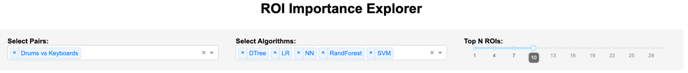
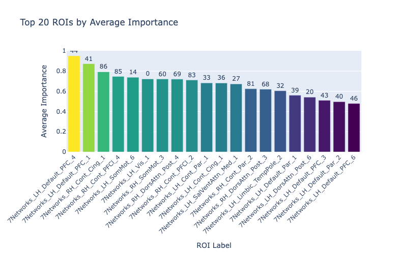
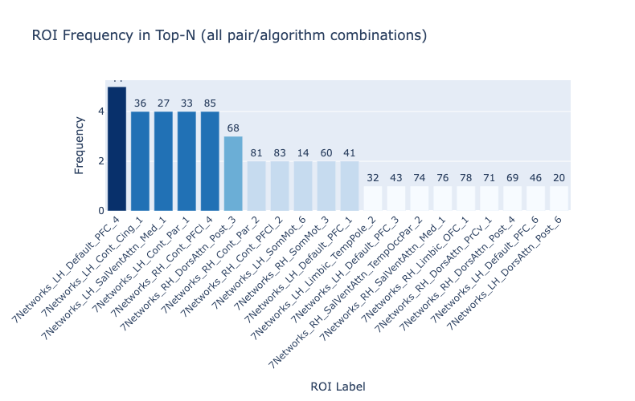
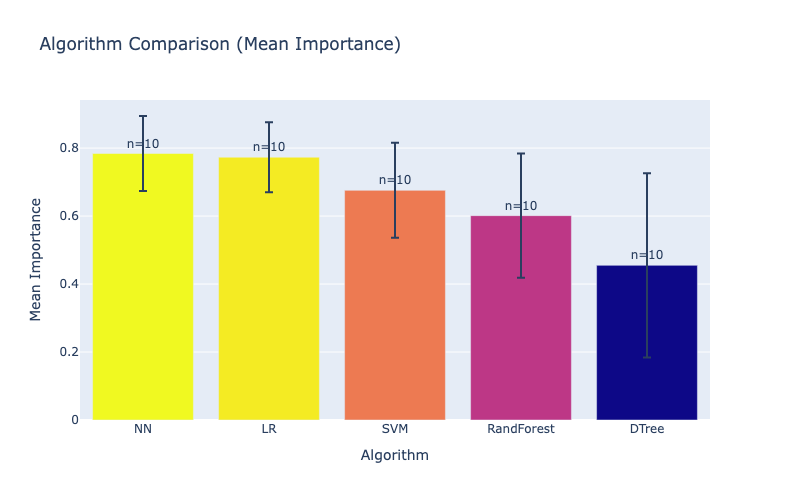
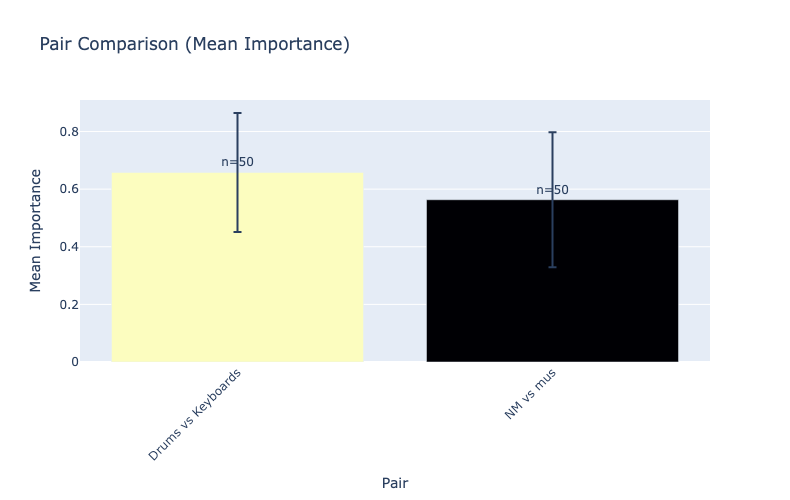
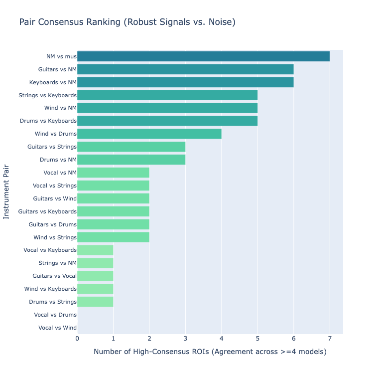
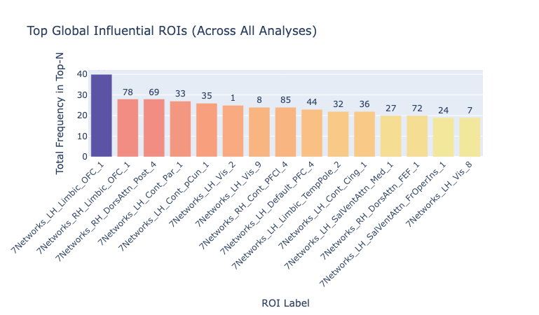

=============================
ROI Explorer Dashboard
=============================

An interactive dashboard for analyzing ROI (Region of Interest) feature importance extracted from fMRI machine learning pipelines.

Usage
-----
.. code-block:: bash

    python explore_roi.py /path/to/roi_importance_all.csv --port 8050

Installation
------------

The dashboard requires ``dash`` and ``plotly`` packages. Install them with:

.. code-block:: bash

    pip install dash>=2.14.0 plotly>=5.14.0 pandas>=1.5.0

Dashboard Controls
------------------

* **Select Pairs:** Filter by specific group comparisons (e.g., Condition A vs Condition B).
* **Select Algorithms:** Filter by ML models (LR, SVM, DTree, RandForest, NN).
* **Top N ROIs:** Sets the threshold for how many top-ranking ROIs are included in the calculations. Each ML model ranks the brain regions by importance. If you set the slider to 10, the dataset is filtered to include only the top 10 ROIs for each pair and algorithm. All graphs and summary statistics are calculated using *only* this filtered subset.

Visualizations & Interpretation
-------------------------------

1. Top 20 ROIs by Average Importance
^^^^^^^^^^^^^^^^^^^^^^^^^^^^^^^^^^^^

* **What it shows:** A bar chart of the absolute highest average importance scores among the filtered Top-N ROIs. The number above the bar indicates the roi number.
* **What to look for:** Look for the tallest bars. These specific regions carry the heaviest predictive weight in the models' decision boundaries. However, a high score here doesn't necessarily mean the ROI is stable across all models (see Chart 2).

2. ROI Frequency in Top-N
^^^^^^^^^^^^^^^^^^^^^^^^^

* **What it shows:** A count of how many times each ROI made it into the Top-N list across all selected pairs and algorithms.
* **What to look for:** Look for consistency. An ROI with high frequency is a stable, reliable biomarker because multiple different algorithms found it important. An ROI might have a huge importance score in Chart 1, but if it has a low frequency here, it means it is an artifact of one specific algorithm rather than a robust biological signal.

3. Algorithm Comparison (Mean Importance)
^^^^^^^^^^^^^^^^^^^^^^^^^^^^^^^^^^^^^^^^^

* **What it shows:** The average importance score grouped by the ML algorithm, including error bars (standard deviation).
* **What to look for:** The error bars show the spread of importance scores *among the Top-N ROIs*. A large error bar means the model relies heavily on 1 or 2 "superstar" ROIs (e.g., Rank 1 is vastly more important than Rank 10). A small error bar means the model distributes its predictive weight more evenly among all the top regions.

4. Pair Comparison (Mean Importance)
^^^^^^^^^^^^^^^^^^^^^^^^^^^^^^^^^^^^

* **What it shows:** The average importance score for each pair, calculated across the Top-N ROIs from all selected algorithms combined.
* **What to look for:** This graph compares the overall feature strength between different pairs. A pair with a high mean importance indicates that the models found very dominant, distinct features to separate those two specific groups. Small error bars show a strong consensus: the different models not only found important ROIs, but also agreed on their relative strength.

5. Pair Consensus Ranking (Robust Signals vs. Noise)
^^^^^^^^^^^^^^^^^^^^^^^^^^^^^^^^^^^^^^^^^^^^^^^^^^^^

* **What it shows:** A ranking of all pairs based on how many ROIs reached "high consensus". High consensus is defined as an ROI appearing in the Top-N for at least 4 different ML models for that specific pair.
* **What to look for:** This graph separates biological signal from noise. Pairs at the top (long bars) have robust, unmistakable brain differences that almost all algorithms agree on. Pairs at the bottom (short/zero bars) lack consensus, suggesting the models are struggling to find consistent differences, or are overfitting to noise.

6. Top Global Influential ROIs
^^^^^^^^^^^^^^^^^^^^^^^^^^^^^^

* **What it shows:** The absolute frequency of ROIs across *all* analyses, summarizing the entire dataset - all pairs regardless of filters.
* **What to look for:** Identify the "core" brain regions driving the classification globally. These are the most universal ROIs in your entire experiment.

Data Format
-----------

The dashboard expects ``roi_importance_all.csv`` with the following columns:

.. list-table::
   :header-rows: 1

   * - Column
     - Type
     - Description
   * - pair
     - string
     - Group pair being compared (e.g., "Drums vs Keyboards")
   * - group_0
     - string
     - First group in comparison
   * - group_1
     - string
     - Second group in comparison
   * - ml_model
     - string
     - Machine learning algorithm (LR, SVM, DTree, RandForest, NN)
   * - roi_index
     - int
     - ROI numerical identifier (0-99 for 100-region atlas)
   * - roi_label
     - string
     - ROI human-readable name (e.g., "7Networks_LH_Vis_1")
   * - importance
     - float
     - Feature importance score (not normalized)
   * - rank
     - int
     - Ranking within pair × algorithm (1=most important)
   * - feature_set
     - int
     - Feature set version (0 or 1)
   * - importance_method
     - string
     - Method used to compute importance
   * - model_path
     - string
     - Path to saved model file

Data Normalization
------------------
Please note that while the raw importance scores in the original CSV file are not normalized, **all data displayed in the dashboard graphs is normalized**. This allows for direct and fair comparisons across different machine learning models.
